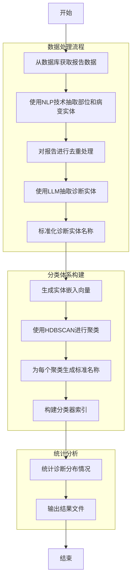

# 放射报告实体抽取与分类系统

本系统旨在从原始放射报告文本中抽取标准化的部位实体和病变实体，并对这些实体进行智能分类。该系统结合了知识图谱和大语言模型（LLM）技术，实现了从非结构化文本到结构化数据的转换。

## 目录结构

```
.
├── radiology_classifier.py     # 主程序文件
├── keyword_extraction.py       # 关键词提取模块
├── system_config.ini           # 系统配置文件
├── user_config.ini             # 用户配置文件
├── README.md                   # 说明文档
└── requirements.txt            # 依赖包列表
```

## 系统功能

1. **实体抽取**：
   - 从放射科报告中抽取诊断实体
   - 使用大语言模型进行精确的信息抽取

2. **实体标准化**：
   - 对抽取的实体进行标准化命名
   - 统一医学术语表达方式

3. **智能聚类**：
   - 利用嵌入向量和HDBSCAN算法对诊断实体进行聚类
   - 自动生成类别名称

4. **分类器构建**：
   - 构建可用于新报告分类的索引文件
   - 生成可复用的分类模型

5. **统计分析**：
   - 统计诊断分布情况
   - 输出结构化数据供进一步分析

## 工作流程



### 详细步骤说明

1. **数据获取**：
   - 从PACS数据库中查询指定时间段的放射科报告
   - 清洗HTML标签，获取纯文本内容

2. **实体抽取**：
   - 使用[Knowledge Graph]技术抽取报告中的部位信息
   - 使用[LLM]从报告中抽取诊断实体
   - 对抽取的实体进行去重处理

3. **实体标准化**：
   - 使用LLM API对诊断实体进行标准化命名
   - 统一医学术语表达方式

4. **嵌入向量生成**：
   - 调用嵌入API为每个标准化实体生成向量表示

5. **聚类分析**：
   - 使用HDBSCAN算法对实体向量进行聚类
   - 自动确定最优聚类数量

6. **类别命名**：
   - 为每个聚类生成标准的类别名称
   - 使用LLM归纳同类实体的通用名称

7. **分类器构建**：
   - 计算每个类别的中心向量
   - 构建分类器索引文件

8. **统计分析**：
   - 统计各类诊断在报告中的分布情况
   - 输出结构化数据文件

## 环境配置

### 系统要求

- Python 3.8+
- SQL Server数据库访问权限
- 大语言模型API访问权限
- 嵌入模型API访问权限

### 依赖安装

```bash
pip install -r requirements.txt
```

### 配置文件

#### system_config.ini
系统级配置文件，包含数据库连接信息、API地址等。

#### user_config.ini
用户级配置文件，包含自定义参数。

#### 环境变量
需要配置以下环境变量：

```env
DEFAUT_DATA=默认数据路径
DEFAUT_CASE=默认案例路径
ENDPOINT_IP=API端点IP地址
LLM_API_URL=大语言模型API地址
LLM_MODEL_NAME=大语言模型名称
EMBEDDING_API_URL=嵌入模型API地址
EMBEDDING_MODEL_NAME=嵌入模型名称
```

## 使用方法

### 基本运行

```bash
python radiology_classifier.py
```

### 指定时间范围运行

修改[radiology_classifier.py](file:///F:/radiology_classifier/radiology_classifier.py#L395-L395)中的[start_time](file:///F:/radiology_classifier/radiology_classifier.py#L827-L827)和[end_time](file:///F:/radiology_classifier/radiology_classifier.py#L828-L828)变量：

```python
if __name__ == "__main__":
    start_time='2025-1-1'
    end_time='2025-1-31'
    main(start_time, end_time)
```

### 使用已有实体和嵌入文件

如果已有之前运行生成的实体和嵌入文件，可以跳过相应步骤：

```python
main(start_time, end_time, entities_file="report_to_diagnoses_map.json", embeddings_file="all_embeddings.npy")
```

## 输出文件

1. **classifier_index.json**：
   - 分类器索引文件
   - 包含每个类别的标准名称和中心向量

2. **report_to_diagnoses_map.json**：
   - 报告到诊断实体的映射文件
   - 用于后续分析和重用

3. **all_embeddings.npy**：
   - 实体嵌入向量文件
   - NumPy格式，可用于快速重载

4. **diagnosis_distribution.xlsx**：
   - 诊断分布统计文件
   - Excel格式，便于查看和分析

## 核心组件说明

### [radiology_classifier.py](file:///F:/radiology_classifier/radiology_classifier.py#L1-L833)

主程序文件，包含以下主要功能模块：

- LLM API调用接口
- 嵌入模型API调用接口
- 实体抽取提示词构建
- 类别命名提示词构建
- 数据获取与处理流程
- 嵌入向量生成
- HDBSCAN聚类分析
- 分类器索引构建
- 统计分析与结果输出

### [keyword_extraction.py](file:///F:/radiology_classifier/keyword_extraction.py#L1-L298)

关键词提取模块，主要负责：

- 部位实体抽取
- 方位词识别与处理
- 实体标准化处理

## 性能优化

1. **多进程处理**：
   - 使用[multiprocessing](file:///F:/radiology_classifier/radiology_classifier.py#L38-L38)库并行处理大量报告
   - 可通过[n_processes](file:///F:/radiology_classifier/radiology_classifier.py#L38-L38)变量调整进程数

2. **缓存机制**：
   - 使用[lru_cache](file:///F:/radiology_classifier/radiology_classifier.py#L53-L53)装饰器缓存API调用结果
   - 避免重复调用，提高处理速度

3. **批处理**：
   - 嵌入向量生成采用批量处理方式
   - 减少API调用次数，提高效率

## 日志系统

系统集成了完整的日志记录功能：

- 控制台实时输出
- 文件持久化记录
- 自动轮转，避免日志文件过大
- 日志文件名：[cllasifier_radiology.log](file:///F:/radiology_classifier/cllasifier_radiology.log)

## 故障排除

### 常见问题

1. **API调用失败**：
   - 检查网络连接
   - 验证API地址和密钥配置
   - 查看日志文件中的错误信息

2. **数据库连接失败**：
   - 检查数据库连接字符串
   - 验证数据库服务状态
   - 确认用户权限

3. **聚类效果不佳**：
   - 调整HDBSCAN参数
   - 增加训练数据量
   - 检查嵌入质量

### 日志查看

```bash
tail -f cllasifier_radiology.log
```

## 扩展开发

### 添加新功能

1. 创建新的处理函数
2. 在主流程中调用新函数
3. 更新配置文件和环境变量

### 模型优化

1. 更换更合适的LLM模型
2. 调整提示词模板
3. 优化嵌入模型参数

## 版权信息

本系统仅供内部使用，未经授权不得用于商业用途。

## 联系方式

如有问题，请联系系统维护人员。